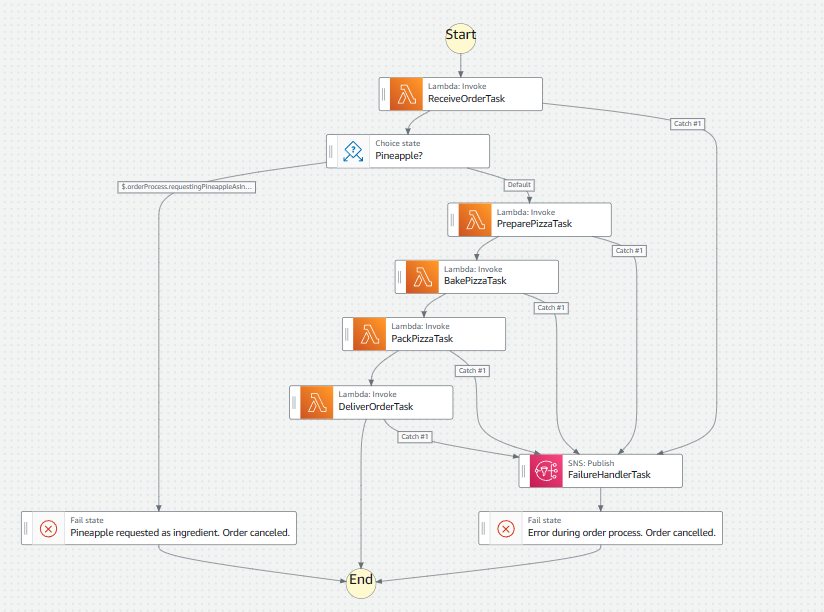

# Cloud Pizza 

This project sets up an AWS infrastructure to handle the simulation of a pizza order-delivery process. 
This example uses AWS CDK, TypeScript, API Gateway, Lambda Functions, Step Functions, and SNS for notifications.
Its a brief and simple but broad example of the applications and capabilities of the AWS cloud and the practice of new 
development approaches like Infrastructure as Code (IaC).
It will walk through the setup process to test, deploy and build the project.

1. [IaC](https://docs.aws.amazon.com/whitepapers/latest/introduction-devops-aws/infrastructure-as-code.html)
2. [AWS CDK](https://docs.aws.amazon.com/whitepapers/latest/introduction-devops-aws/aws-cdk.html)


Cloud Pizza Order-Delivery Process

## Requirements

Not much really, just make sure to:
1. Have an AWS account.
2. NodeJs installed (v18.x).<br />
    2.1. [NodeJs](https://nodejs.org/en/download/current)<br />
    2.2. To check if node its installed and the current version run in the command line "node -v". It should display NodeJs version.
    <pre><code>
    node -v
    </code></pre>
3. Postman for api testing.<br />
    3.1 [Postman](https://www.postman.com/downloads/)

## Installation

1. Clone the repository.<br />
    1.1. [Useful link](https://docs.github.com/en/repositories/creating-and-managing-repositories/cloning-a-repository)
2. Install dependencies.<br />
    2.1. Navigate to the project directory selected as destination for the repository.<br />
    2.2. Locate in the root directory and execute "npm install".
        <pre><code>
        npm install
        </code></pre>
        It will install the aws-cdk package, wait little.<br />
    2.3. Next move into the subdirectory "cloud-pizza-order-delivery-process", once there execute "npm install" to install the other dependencies and wait a little.
        <pre><code>
        npm install
        </code></pre>

## Unit Testing
1. To execute the unit tests, locate inside the "cloud-pizza-order-delivery-process" directory and execute "npm run test".
    <pre><code>
    npm run test
    </code></pre>
2. There are 3 files of unit test inside the "test" directory.<br />
    2.1. deliverOrder.test.ts: test functionality for the order delivery step.<br />
    2.2. pizzaOrderDeliveryProcess.test.ts: test functionality deploying process assuring some main resources are created.<br />
    2.3. receiveOrder.test.ts: test functionality for the order receiving step.<br />
3. To execute the unit tests to specific files execute "npm run test file-name".
    <pre><code>
    npm run test deliverOrder.test.ts
    </code></pre>

## Deployment
1. To deploy the infrastructure, first it must be executed the bootstrapping process. This is because AWS CDK requires some AWS services to be available. For this the AWS account number and region will be needed.
2. To execute bootstrapping, located inside the directory "cloud-pizza-order-delivery-process", execute "npm run cdk bootstrap aws://aws-account-number/aws-region".
    <pre><code>
    npm run cdk bootstrap aws://111111111111/us-east-200
    </code></pre>
    Wait a couples of seconds while the infrastructure is being configured.
3. Once that, execute "npm run cdk deploy", and be patient. It may ask if the user wish to deploy the changes, answer yes.
    <pre><code>
    npm run cdk deploy
    </code></pre>
    <pre><code>
    Do you wish to deploy these changes (y/n)? y
    </code></pre>
4. If everything went well and the process is done, it will show 2 outputs and the Stack ARN. Keep the outputs for usage.
    <pre><code>
        Outputs:
        PizzaOrderDeliveryProcessStack.ApiUrl = https://111111111.execute-api.us-east-200.amazonaws.com/prod/
        PizzaOrderDeliveryProcessStack.PizzaOrderDeliveryApiEndpoint111111 = https://11111111.execute-api.us-east-200.amazonaws.com/prod/
        Stack ARN:
        arn:aws:cloudformation:us-east-200:11111111111:stack/PizzaOrderDeliveryProcessStack/aaa-aaaaa-aaaaa-aaaaaaaa
    </code></pre>

## Usage
1. To test the api, it can be used a tool like Postman to send request and get response. Use the outputs from the deploy process.<br />
    1.1 [Useful link](https://learning.postman.com/docs/getting-started/first-steps/sending-the-first-request/)<br />
2. "POST /": Initiate the pizza order process.<br />
    2.1. Request structure (this will return a success response).
    ```json
    {
        "orderName": "Peter Ferguson",
        "deliveryAddress": "street A1 apartment A67, NY",
        "pizza": {
            "size": "Large",
            "pepperoni" : "yes",
            "bacon" : "yes",
            "mushrooms" : "no",
            "meat" : "yes",
            "pineapple": "no"
        }
    }
    ```
    2.2 To receive a failure response set "pineapple" property to "yes" or remove the whole "pizza" object from the structure.
3. Successful execution response. The order status can be appreciated in the "orderProcess" section.
    ```json
    {
        "body": {
            "orderName": "Peter Ferguson",
            "deliveryAddress": "street A1 apartment A67, NY",
            "pizza": {
                "size": "Large",
                "pepperoni": "yes",
                "bacon": "yes",
                "mushrooms": "no",
                "meat": "yes",
                "pineapple": "no"
            }
        },
        "querystring": {},
        "path": {},
        "orderProcess": {
            "ExecutedVersion": "$LATEST",
            "Payload": {
                "message": "Sending order",
                "order": {
                    "orderIdentifier": "ORD725649c2-f53e-412d-8cbb-dd99793d72bd",
                    "orderName": "Peter Ferguson",
                    "deliveryAddress": "street A1 apartment A67, NY",
                    "pizza": {
                        "pepperoni": true,
                        "bacon": true,
                        "mushrooms": false,
                        "meat": true,
                        "size": "Large"
                    }
                }
            },
            "SdkHttpMetadata": {
                "AllHttpHeaders": {
                    "X-Amz-Executed-Version": [
                        "$LATEST"
                    ],
                    "x-amzn-Remapped-Content-Length": [
                        "0"
                    ],
                    "Connection": [
                        "keep-alive"
                    ],
                    "x-amzn-RequestId": [
                        "ef596c13-fb11-492c-9271-0d2d851a7a5a"
                    ],
                    "Content-Length": [
                        "259"
                    ],
                    "Date": [
                        "Fri, 20 Oct 2023 08:33:49 GMT"
                    ],
                    "X-Amzn-Trace-Id": [
                        "root=1-65323b6a-7d51750f7c22e6317eca587c;parent=430ec170ffa477a7;sampled=1;lineage=916beb46:0"
                    ],
                    "Content-Type": [
                        "application/json"
                    ]
                },
                "HttpHeaders": {
                    "Connection": "keep-alive",
                    "Content-Length": "259",
                    "Content-Type": "application/json",
                    "Date": "Fri, 20 Oct 2023 08:33:49 GMT",
                    "X-Amz-Executed-Version": "$LATEST",
                    "x-amzn-Remapped-Content-Length": "0",
                    "x-amzn-RequestId": "ef596c13-fb11-492c-9271-0d2d851a7a5a",
                    "X-Amzn-Trace-Id": "root=1-65323b6a-7d51750f7c22e6317eca587c;parent=430ec170ffa477a7;sampled=1;lineage=916beb46:0"
                },
                "HttpStatusCode": 200
            },
            "SdkResponseMetadata": {
                "RequestId": "ef596c13-fb11-492c-9271-0d2d851a7a5a"
            },
            "StatusCode": 200
        }
    }
    ```
4. Failure execution response. "Pineapple" set to "yes".
    ```json
    {
        "error": "Failed to make pizza.",
        "cause": "Customer asked for pineapple."
    }
    ```
5. Failure execution response. No "pizza" data.
    ```json
    {
        "error": "We are having problems processing your order, our apologies.",
        "cause": "An unknown error happened during the order process."
    }
    ```

## Cleanup
To remove the infrastructure and delete all resources created, execute "npm run cdk destroy".
It may ask to confirm the deletion, so type "yes".
    <pre><code>
     npm run cdk destroy
    </code></pre>
    <pre><code>
     Are you sure you want to delete: PizzaOrderDeliveryProcessStack (y/n)? y
    </code></pre>

## Useful commands
- "npm run build": compile typescript to javascript.
- "npm run cdk synth": emits the synthesized CloudFormation template.
    <pre><code>
    npm run cdk build
    </code></pre>
    <pre><code>
    npm run cdk synth
    </code></pre>